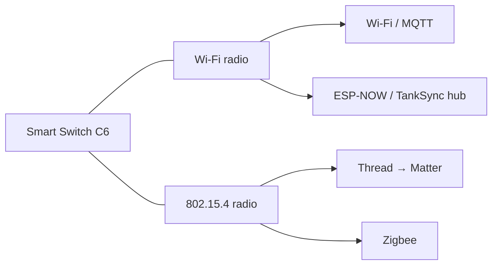

# Smart Switch — Multi-Transport Roadmap (Matter / Zigbee / WiFi / ESP-NOW)

> **Status: planning / scope only.** Nothing here is built yet beyond the
> current ESP-NOW hub pairing. This document scopes *how* user-selectable
> transports would work on the ESP32-C6 and in what order to build them. It is
> a milestone plan, not a spec.

## DECIDED 2026-06-12 — the product architecture

One hardware product (ESP32-C6, 4 MB flash), **two switchable firmware images**,
mode chosen by the user in the SoftAP portal:

- **TankSync image** (ships today, ss-v0.2.x): ESP-NOW hub pairing → the full
  pump brain (level automation, source guard, anti-cycling). The premium mode.
- **Matter image** (next build): Matter-over-WiFi for everyone WITHOUT a hub —
  Apple Home, Alexa, Google Home, and Home Assistant (HA speaks Matter
  natively, which is why the separately-scoped WiFi/MQTT standalone mode is
  **dropped** — Matter covers that audience with one stack).
  Endpoints: On/Off Plug-in Unit + Temperature Sensor (all ecosystems) +
  Electrical Power Measurement / Matter 1.3 (HA fully; big-3 rolling out).
- The portal's mode switch flashes the other image into the second OTA slot
  and reboots into it. A failed Matter boot falls back to the TankSync image.
- **Both images carry the autonomous safety brain** (inrush-tolerant
  over-current, welded-contact, dry-run, max-runtime, over-temp) + the portal
  with per-board current calibration. That safety layer is the differentiator
  no generic Matter plug has — "the smart switch that's safe to put on a motor".
- Flash budget: TankSync image ~0.9 MB (fits anywhere); the Matter image must
  stay **under ~1.9 MB** (size-optimized, WiFi transport only, no Thread at
  first) to fit a 4 MB dual-slot table. If it can't be held there, the escape
  hatch is the 8 MB module (C6-WROOM-1-N8) on a board respin.
- Zigbee: not building (fragments the lineup; Matter wins interop).
- Thread (→ Matter-over-Thread): later option — same Matter data model, the
  C6's 802.15.4 radio already supports it.

## Why the C6 makes this possible

The ESP32-C6 has **two independent 2.4 GHz radios**:

- a **Wi-Fi 6 (802.11)** radio — carries Wi-Fi/MQTT **and** ESP-NOW (ESP-NOW rides on the Wi-Fi PHY), and
- an **802.15.4** radio — carries **Thread (→ Matter)** *or* **Zigbee**.

Plus Bluetooth LE on the shared 2.4 GHz front-end (useful for commissioning).

## The hard constraint: pick ONE primary stack

The radios coexist, but the **protocol stacks do not**:

- **Thread/Matter** and **Zigbee** both own the 802.15.4 radio — **mutually exclusive** (one or the other, never both).
- **Matter** (esp-matter) and **Zigbee** (esp-zigbee-sdk) are each **large** (~1–1.5 MB of flash + meaningful RAM). Stacking Matter **and** Zigbee **and** Wi-Fi **and** the switch logic won't fit a 4 MB part — and the XIAO test board is only 2 MB.

So "user can choose" realistically means **one selected transport per unit**, not all-at-once. Two viable shapes:

| Shape | How the user chooses | Trade-off |
|---|---|---|
| **Build-time variants** (recommended first) | A different firmware binary per transport (`-DTRANSPORT=espnow\|wifi\|matter\|zigbee`); user flashes the one they want. | Simplest, smallest, ships fastest. "Choice" = which binary you flash. |
| **Runtime selector** | One firmware, a config (SoftAP / button) picks the stack; an OTA-style partition loads it. | Best UX, but heaviest — needs partitions sized for the largest stack + careful re-init. A later evolution. |

Recommendation: **build-time variants first**, converge toward a runtime selector once the stacks are individually proven.

## Per-transport scope

| Transport | What it gives | Commissioning | Effort |
|---|---|---|---|
| **ESP-NOW** (today) | Pairs to a TankSync hub; hub runs the pump brain. | Button 2 s → channel sweep → hub `PAIR_ACK`. | ✅ done |
| **Wi-Fi / MQTT** (v0.2) | Standalone — reports to any MQTT broker / Home Assistant with **no hub**. | SoftAP portal (see the SoftAP doc) for Wi-Fi creds + broker. | Medium — reuses the hub's MQTT patterns. |
| **Matter-over-Thread** (v0.3) | Native Apple Home / Google / Alexa; local, standards-based. Appears as a Matter on/off plug + power metering. | Matter QR code + a Thread Border Router on the network. | Large — esp-matter SDK, Thread, commissioning, certification questions. |
| **Zigbee** (v0.3+) | Joins an existing Zigbee network (Hue/deCONZ/ZHA/Z2M) as an on/off plug + metering. | Zigbee coordinator "permit join". | Large — esp-zigbee-sdk; separate from Matter. |

## Suggested order

1. **Finish the ESP-NOW basics** — pairing reliability, the SoftAP config portal, current-sensor calibration. (These make *every* transport better; do them first.)
2. **Wi-Fi / MQTT standalone (v0.2)** — biggest reach for least new-stack risk; reuses known MQTT code.
3. **Matter-over-Thread (v0.3)** — the headline "works with Apple/Google/Alexa" feature; build as its own variant.
4. **Zigbee (v0.3+)** — for users already on a Zigbee hub; its own variant.

## Open questions to resolve before building 3/4

- **Flash budget** — confirm the production board's flash size (4 MB min for Matter/Zigbee; the 2 MB XIAO can't host them).
- **Matter certification** — DIY/non-certified Matter devices work on most ecosystems in "uncertified" mode; selling a *certified* Matter product is a separate (paid) process.
- **One metering model** — define the on/off + power/energy attribute mapping once, so Matter, Zigbee, and MQTT all expose the same data shape.

---

*This is a living plan. The near-term work (pairing reliability, SoftAP/config, calibration) is the foundation; Matter and Zigbee are deliberately sequenced after it.*
